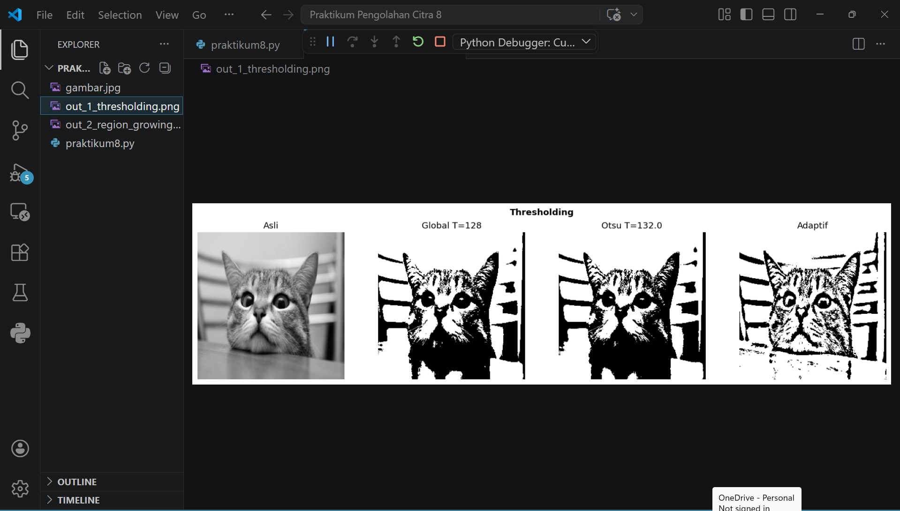
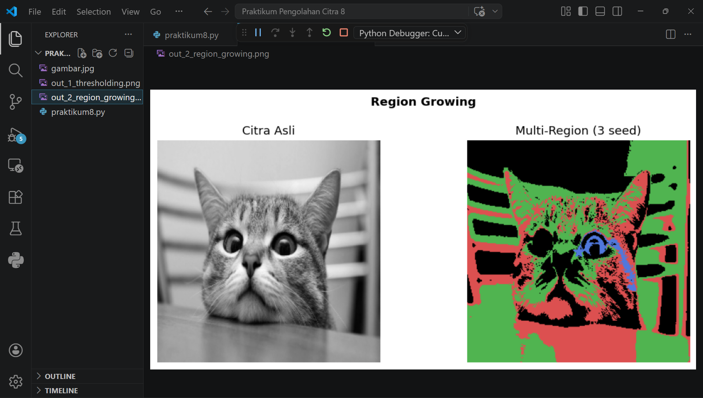
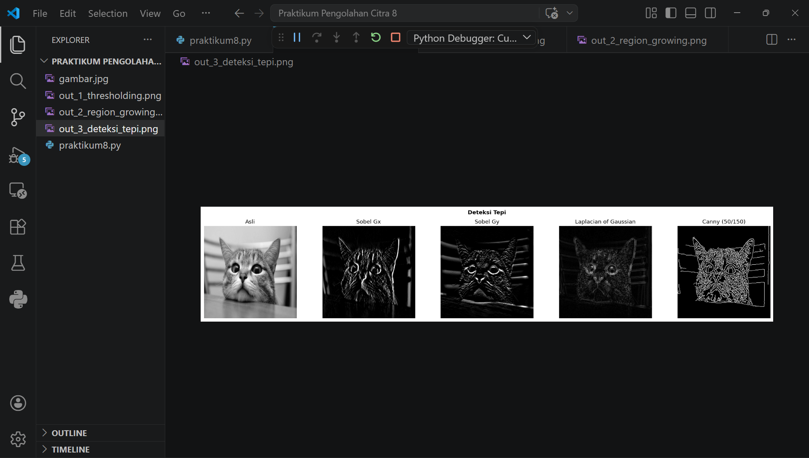
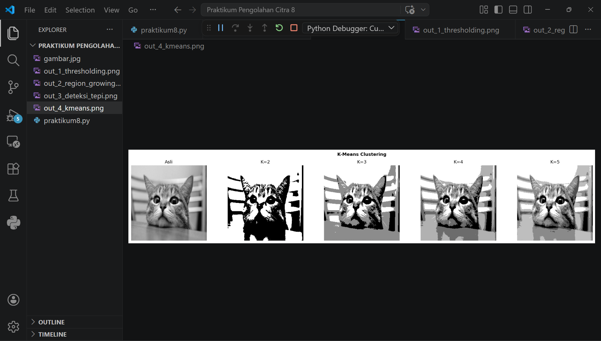
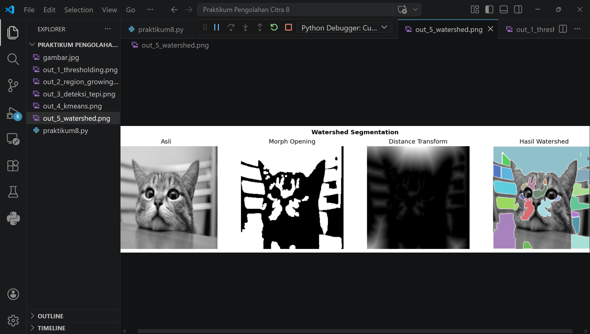
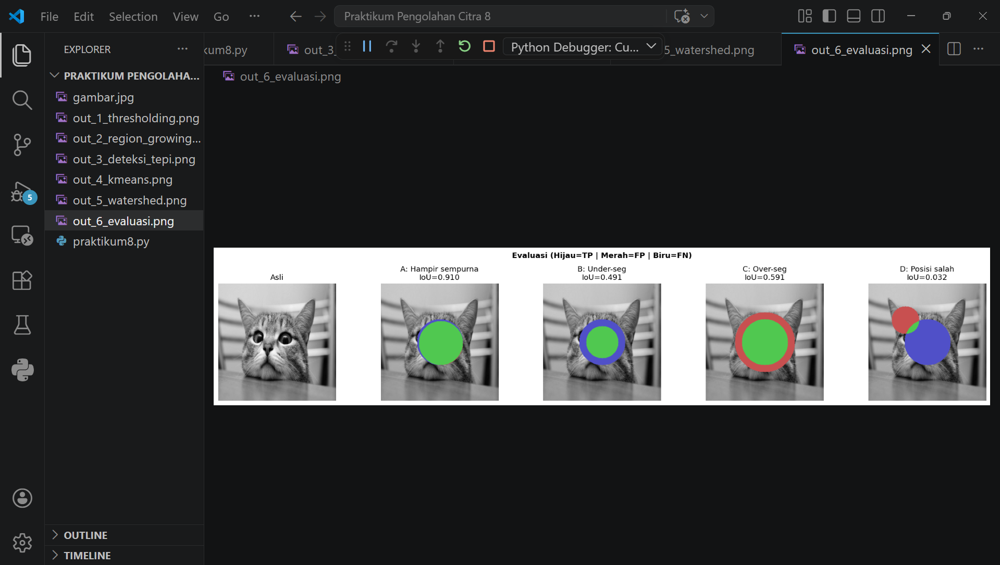

# Praktikum 8 — Pengolahan Citra Digital: Segmentasi Citra
 
| | |
|---|---|
| **Nama** | Afdhal Agislam |
| **NIM** | 312410445 |
| **Kelas** | I241E |

## Deskripsi
Praktikum ini membahas berbagai teknik segmentasi citra menggunakan Python dan OpenCV. Segmentasi citra adalah proses membagi citra menjadi beberapa bagian atau region yang memiliki karakteristik serupa, bertujuan untuk mempermudah analisis dan pemrosesan citra lebih lanjut.
 
---

## Struktur Folder
```
Praktikum Pengolahan Citra 8/
├── gambar.jpg
├── praktikum8.py
├── out_1_thresholding.png
├── out_2_region_growing.png
├── out_3_deteksi_tepi.png
├── out_4_kmeans.png
├── out_5_watershed.png
└── out_6_evaluasi.png
```

---

## Library yang Digunakan
```python
pip install opencv-python numpy matplotlib scikit-image scipy
```

| Library | Kegunaan |
|---|---|
| `opencv-python` | Pemrosesan citra utama |
| `numpy` | Operasi array dan matriks |
| `matplotlib` | Visualisasi dan plotting |
| `scikit-image` | Watershed dan peak local max |
| `scipy` | Distance transform |

---

## Topik yang Dibahas

### 1. Thresholding
Thresholding adalah teknik segmentasi paling dasar yang mengubah citra grayscale menjadi citra biner berdasarkan nilai ambang batas (threshold).

**Tiga metode yang digunakan:**

- **Global (T=127)** — Nilai threshold ditentukan secara manual. Semua piksel di atas T menjadi putih, di bawah T menjadi hitam.
- **Otsu** — Threshold dihitung otomatis dengan memaksimalkan variansi antar kelas (between-class variance). Cocok untuk citra dengan histogram bimodal.
- **Adaptif** — Threshold dihitung per-area kecil (neighborhood), sehingga lebih baik untuk citra dengan pencahayaan tidak merata.

```python
# Global
ret, thresh = cv2.threshold(gray, 127, 255, cv2.THRESH_BINARY)

# Otsu
ret2, otsu = cv2.threshold(gray, 0, 255, cv2.THRESH_BINARY + cv2.THRESH_OTSU)

# Adaptif
adaptive = cv2.adaptiveThreshold(gray, 255, cv2.ADAPTIVE_THRESH_MEAN_C,
                                  cv2.THRESH_BINARY, 11, 2)
```

**Output:**


---

### 2. Region Growing
Region Growing adalah algoritma segmentasi berbasis piksel yang mengelompokkan piksel-piksel tetangga yang memiliki intensitas serupa ke dalam satu region.

**Algoritma (BFS):**
1. Tentukan seed point (titik awal)
2. Periksa 8 tetangga piksel
3. Tambahkan tetangga ke region jika `|I(tetangga) - I(seed)| ≤ threshold`
4. Ulangi sampai tidak ada piksel baru yang bisa ditambahkan

```python
def region_growing(citra, seed, threshold=25):
    # BFS dari seed point
    # Tambahkan tetangga jika selisih intensitas <= threshold
```

**Pengujian:** 3 seed point dengan warna berbeda (merah, hijau, biru)

**Output:** 



---

### 3. Deteksi Tepi (Edge Detection)
Deteksi tepi digunakan untuk menemukan batas-batas objek dalam citra berdasarkan perubahan intensitas yang tajam.

**Operator yang digunakan:**

- **Sobel Gx** — Mendeteksi tepi arah horizontal menggunakan kernel:
  ```
  [-1  0  1]
  [-2  0  2]
  [-1  0  1]
  ```
- **Sobel Gy** — Mendeteksi tepi arah vertikal (transpose dari Gx)
- **Laplacian of Gaussian (LoG)** — Gaussian blur terlebih dahulu lalu Laplacian untuk mengurangi noise
- **Canny (50/150)** — Metode paling robust, melalui 4 tahap: Gaussian → Sobel → Non-Max Suppression → Double Threshold + Hysteresis

```python
# Sobel
Kx = np.array([[-1,0,1],[-2,0,2],[-1,0,1]], dtype=np.float32)
gx = cv2.filter2D(gray.astype(np.float32), -1, Kx)

# Canny
canny = cv2.Canny(gray, 50, 150)
```

**Output:** 



---

### 4. Segmentasi K-Means Clustering
K-Means mengelompokkan piksel ke dalam K cluster berdasarkan kemiripan nilai intensitas. Setiap piksel dianggap sebagai titik data 1D.

**Algoritma:**
1. Inisialisasi K centroid secara acak
2. Assign setiap piksel ke centroid terdekat
3. Update centroid berdasarkan rata-rata cluster
4. Ulangi sampai konvergen

**Pengujian nilai K:** 2, 3, 4, 5

```python
def kmeans_segmentasi(citra, K):
    data = citra.reshape(-1, 1).astype(np.float32)
    kriteria = (cv2.TERM_CRITERIA_EPS + cv2.TERM_CRITERIA_MAX_ITER, 100, 0.2)
    _, labels, centroid = cv2.kmeans(data, K, None, kriteria, 10,
                                      cv2.KMEANS_RANDOM_CENTERS)
```

**Output:** 



---

### 5. Watershed Segmentation
Watershed mensimulasikan proses pengisian air pada topografi citra. Digunakan untuk memisahkan objek-objek yang saling berdekatan atau bersentuhan.

**Tahapan:**
1. **Otsu Thresholding** → binarisasi citra
2. **Morphological Opening** → hilangkan noise kecil
3. **Distance Transform** → hitung jarak tiap piksel ke background
4. **Peak Local Max** → temukan puncak sebagai marker/seed
5. **Watershed** → tumbuhkan region dari marker

```python
dist_tf = ndimage.distance_transform_edt(opening)
coords = peak_local_max(dist_tf, min_distance=15, labels=opening)
markers = label(mask_peak)
ws_labels = watershed(-dist_tf, markers, mask=opening)
```

**Output:** 



---

### 6. Evaluasi Segmentasi
Evaluasi dilakukan untuk mengukur seberapa baik hasil segmentasi dibandingkan dengan ground truth.

**Metrik yang digunakan:**

| Metrik | Formula | Keterangan |
|---|---|---|
| **IoU** (Jaccard Index) | TP / (TP + FP + FN) | Semakin mendekati 1 semakin baik |
| **Dice Coefficient** | 2·TP / (2·TP + FP + FN) | Dice = 2·IoU / (1 + IoU) |

**Visualisasi warna:**
- 🟢 **Hijau** = True Positive (TP) — prediksi benar
- 🔴 **Merah** = False Positive (FP) — prediksi berlebih
- 🔵 **Biru** = False Negative (FN) — area yang terlewat

**Hasil evaluasi:**

| Prediksi | IoU | Dice |
|---|---|---|
| A: Hampir Sempurna | 0.910 | 0.953 |
| B: Under-segmentation | 0.491 | 0.659 |
| C: Over-segmentation | 0.591 | 0.743 |
| D: Posisi Salah | 0.032 | 0.062 |

**Output:** 



---

## Cara Menjalankan
1. Pastikan `gambar.jpg` ada di folder yang sama dengan `praktikum8.py`
2. Install library yang dibutuhkan:
   ```
   pip install opencv-python numpy matplotlib scikit-image scipy
   ```
3. Jalankan script:
   ```
   python praktikum8.py
   ```
4. Tutup setiap jendela gambar yang muncul untuk melanjutkan ke output berikutnya

---

## Kesimpulan
Setiap metode segmentasi memiliki kelebihan dan kekurangannya masing-masing:
- **Thresholding** cocok untuk citra sederhana dengan kontras tinggi
- **Region Growing** baik untuk objek dengan intensitas homogen
- **Deteksi Tepi** efektif menemukan batas objek, Canny paling akurat
- **K-Means** fleksibel untuk segmentasi multi-level berdasarkan intensitas
- **Watershed** unggul untuk memisahkan objek yang saling berdekatan
- **Evaluasi IoU & Dice** memberikan ukuran kuantitatif kualitas segmentasi
